# 科研创新实践 V2023

> **怕什么真理无穷，进一寸有一寸的欣喜                         —— 胡适**

### 写在前面

选课课号：

本课程长期支持文档地址：https://github.com/haohaoalt/rikirobot/blob/main/readme.md

本课程指导老师：余雷、陈良

本课程先修知识：

ubuntu简单使用；ROS安装；ROS基础使用；CMake编译ROS功能包；

2023年助教TAs(Teaching assistants): 

无人车：张昊、潘子豪、李政、胥博文

无人机：马健、钱洲同、陈星、姚远

**课程安排：**
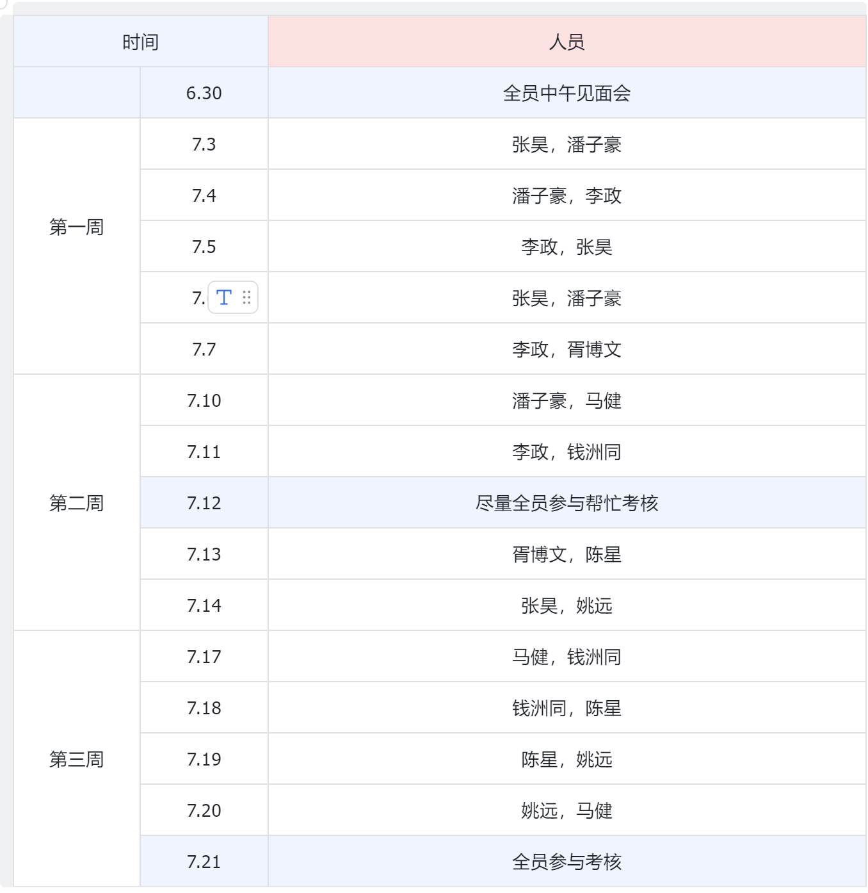


本科生无人车、无人机课程安排
- 0630中午跟学生第一次见面会，确定好分组后，每组派同学领取材料，并在硬件清单上确认开始收到的元器件材料齐全（张昊提前会找胡老师拿到门卡）；
- 0630见面会全员到确定好硬件材料齐全，资料拷贝（无人车资料带U盘拷贝）。
- 按照排班表每天助教值班一天上下午（时间段待定），两人一起。每天可安排班长考勤（填写考勤表）以及值日生整理实验室（填写值日表）。一天结束负责将实验室电源关闭，并将门卡给第二天同学。
- 第二周中间尽量全员到考核选出做无人机队伍，目前计划13~14组。
- 第三周开始同学做无人机。
- 第三周课程结束 全员到最后考核打分。
助教：张昊 潘子豪 李政 胥博文 马健 钱洲同 姚远 陈星 
无人车组数：27组； 无人机组数：13~14组

**课程考核办法（2023待定）：**

| 组成               | 分值   | 办法                                                         |
| ------------------ | ------ | ------------------------------------------------------------ |
| **日常考勤及值日** | 8' +2' | 考勤缺席一次扣1分，值日由每天下午的助教检查，不合格的当天值日小组均扣1-2分，当天应参与值日但未参加的小组扣2'。 |
| **实验报告**       | 待定    | 待定|
| **实际测评**       | 待定   | 键盘控制小乌龟运动；键盘控制小车运动及效果；小车地图构建效果；其他拓展加分项（12+超出算加分） |
| **附加题：无人机** | 待定   | 待定 |

**其他拓展加分项说明：**

- 对于本课程文档的改善有突出贡献；
- 对于本课程内容有某个方面有较深刻理解，包括：对于底层控制代码原理理解清楚；对于整个系统的流程有较深刻把握；对于树莓派端代码的功能实现理解全面清晰；
- 在完成过程中认真、仔细、专业、整洁、有序、团结以及任何make things better；

考核完成后将小车拆除，并填写表格，由助教进行查验（此项为扣分制）


### 1 智能车研究背景

#### 1.1 智能车研究背景

SLAM是Simultaneous Localization and Mapping的缩写，中文译作“同时定位与地图构建”。它是指搭载特定传感器的主体，在没有环境先验信息的情况下，于运动过程中建立环境的模型，同时估计自己的运动。SLAM的目的是解决“定位”与“地图构建”这两个问题，也就是说，一边要估计传感器自身的位置，一边要建立周围环境的模型。

近年来随着科技的发展，涌现出了一大批与SLAM相关的应用点：室内的扫地机器人需要定位，虚拟现实和增强现实需要定位，空中的无人机需要定位……在许多地方，我们都希望知道自身的位置。

传统的小车可以在人为控制下前进或后退，但始终需要人为控制其方向。你会发现，自主运动是许多高级功能的前提。而智能车则在手动操作的基础上，增加了自动避障的功能，从而能够在没有人为参与的情况下，自己规划路径来到达指定的地点。以上所述的这些功能是建立在激光雷达SLAM建图和路径规划避障的基础之上的。

#### 1.2 智能车的项目要求

智能车的底盘采用“差速2轮+2辅助轮”的结构，与电脑建立连接后，可以用键盘控制其往各个方向移动。

智能车配有激光雷达，能够进行SLAM建图。

给智能车定位后，再选择目标地点时，智能车能够自动避障并移动到指定地点。

架构要求：Linux系统平台下运行机器人操作系统ROS系统，需要新开发。以PC端为主、移动设备端为辅（android），通过局域网可实现远程控制。

#### 1.3 智能车的实现方案

为了完成这样一个小车，我们需要：

①在笔记本下使用虚拟机安装ubuntu16.04系统；

②笔记本在ubuntu16.04系统下安装ros平台与ssh协议以及gedit；

③给树莓派安装ubuntu mate16.04系统；

④在ubuntu mate16.04下安装ros平台；

⑤进行rikirobot所需要的工程文件的编译；

⑥给stm32f103烧录单片机程序；

⑦搭建好小车硬件模型并完成各个模块的接线；

⑧建立小车与电脑的连接，进行调试。

在这个过程中，编码器用来测量电机的转速；IMU测量运动的角速度和加速度，从而提供相对的定位信息，获得相对于起点物体所运动的路线；激光雷达用来读取外部环境的信息。

##### 1.3.1 硬件方案

小车的硬件平台架构如下图所示（示意图，本课程主控为树莓派3B）。

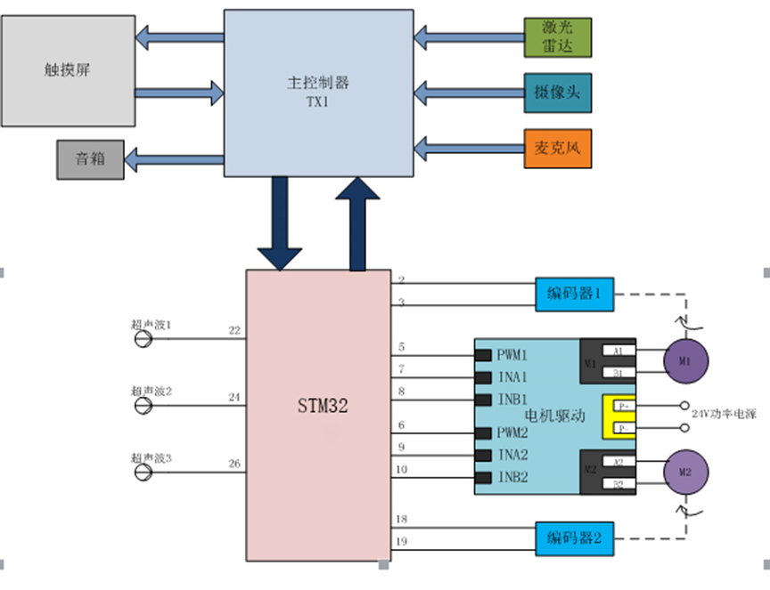

传感器数据读取：使用STM32读取里程计信息，控制电机驱动。

与上位机通信方式：使用串口通信。

上位机：上位机安装Linux操作系统，实现建图、定位、导航等策略。

远程控制协议：使用ssh（安全外壳协议）实现局域网内远程控制。

##### 1.3.2 软件方案

- 上位机策略层：

在本方案中，是由底层进行航迹推演，由上位机发送底层线速度、角速度。采用SLAM，即同时定位与地图构建。本方案使用谷歌的开源算法，使用多传感器融合的方案进行地图构建，使用蒙特卡洛定位算法实现定位。导航部分，在获得地图之后，使用A*算法和迪杰斯特拉算法，对起点和目标点之间的运动进行路径规划。

- 通信层：

使用串口通信实现底层和上位机之间的通信，使用ssh（安全外壳协议）实现局域网内从机对主机的控制。

- 驱动控制及传感器读取：

使用单片机读取编码器信息，控制电机驱动，进行航迹推演，包括计算角速度、线速度、运动距离等。串口发送数据，对运动距离的坐标X，Y；线速度，角速度V，W转角θ；编码成二进制字符串发送给上位机PC。串口接收数据，机器人上电后，向上位机发送的数据为0，PC无操作指令时底层无动作；当PC发送数据给底层指令后，会接收到期望速度，对左右轮进行PID调速。底层接收的数据包括左轮速度和右轮速度。

#### 1.4 最终效果展示

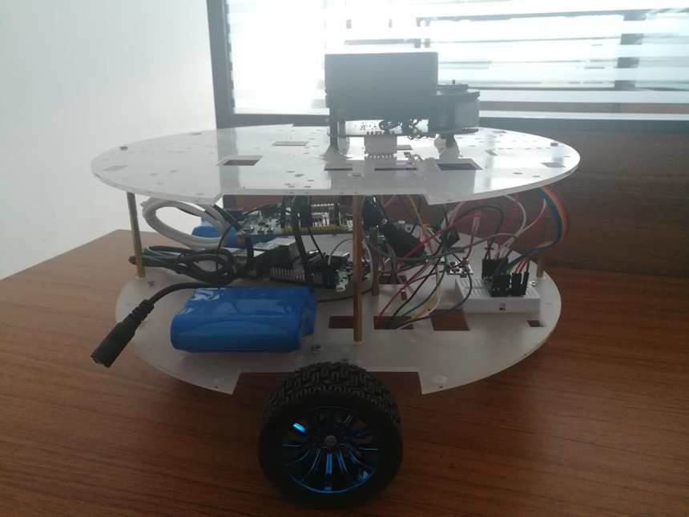

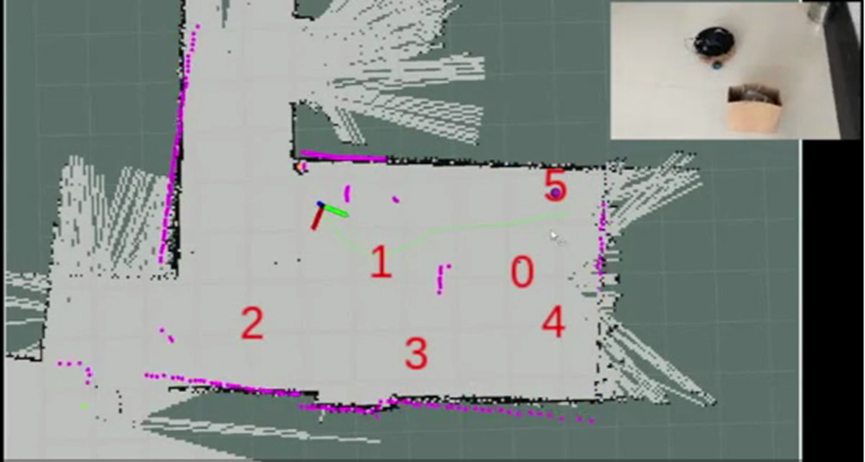

### 2 智能车树莓派系统盘制作及设置

#### 2.1 树莓派系统盘制作

##### 2.1.1 树莓派简介

树莓派是什么？

刚接触对的同学可能不了解。通俗地说，树莓派就是用于学生计算机编程教育设计的一种卡片式电脑。

Raspberry Pi(中文名为“树莓派”,简写为RPi，(或者RasPi / RPI)是为学生计算机编程教育而设计，只有信用卡大小的卡片式电脑，其系统基于Linux。随着Windows 10 IoT的发布，我们也将可以用上运行Windows的树莓派。

树莓派能做什么?

就像其他任何一台运行Linux系统的台式计算机或者便携式计算机那样，利用Raspberry Pi可以做很多事情。当然，也难免有一点点不同。普通的计算机主板都是依靠硬盘来存储数据，但是Raspberry Pi 来说使用SD 卡作为“硬盘”，你也可以外接USB 硬盘。利用Raspberry Pi 可以编辑Office 文档、浏览网页、玩游戏——即使玩需要强大的图形加速器支持的游戏也没有问题。

树莓派支持Ubuntu系统。本次我们使用的树莓派型号为Raspberry Pi 3 Model B。

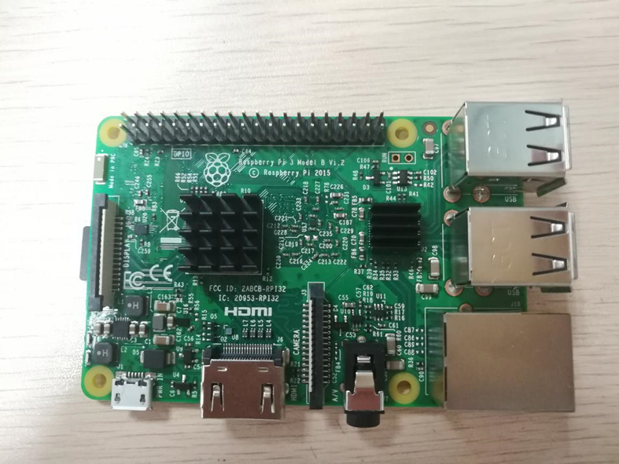

右上方两组接口（一共四个），可以用来连接鼠标、键盘等；中间白字HDMI下方接口用来连接显示器；左下方接口供电；右下方接口可以连接网线。这面中间两侧的黑色方块形的装置是已经贴上去的散热装置。

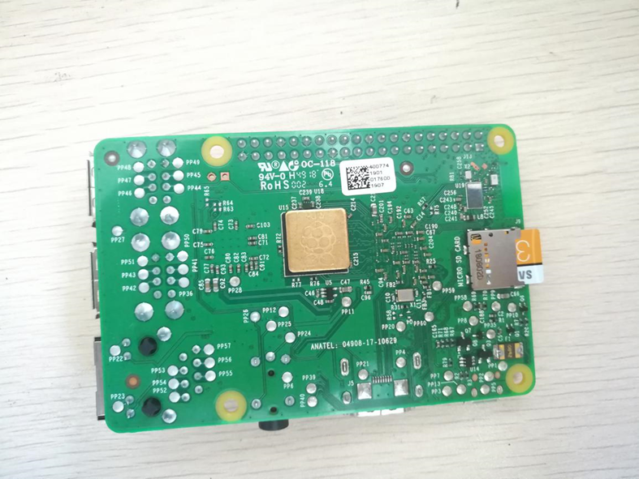

标有白字MICRO SD CARD的右侧部分为SD卡卡槽。金色树莓派标志贴片为已经贴上去的装置。

##### 2.1.2 系统盘写入SD卡

①树莓派Raspberry Pi 3 Model B；

②5V/2A电源及电源线（选择合适的充电头或者使用笔记本USB口）；

③HDMI线；

④读卡器与SD卡一张；

⑤有HDMI接口的显示器。

第一步：将SD卡放入读卡器中，利用SDFormatter格式化SD卡（新的SD卡无需这一步）。

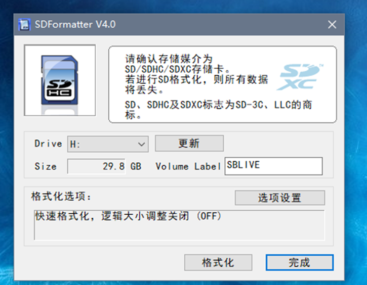

选中SD卡的盘符➡️格式化➡️完成

第二步：准备好ubuntu mate16.04镜像文件和win32disk软件。

第三步：利用win32disk将系统写入SD卡中：

①打开win32disk软件，选择好镜像文件路径和要写入的磁盘；

②点击write——yes便开始写入；

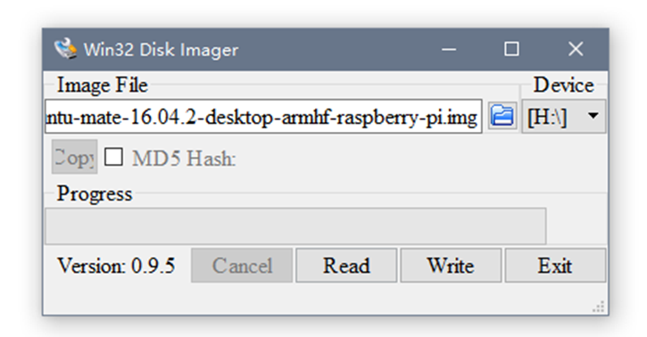

③写入完毕后会弹出是否需要格式化，点击取消。

第四步：将SD卡插入树莓派，使用micro usb给树莓派供电（最好是5V/2.5A的供电，5V/2A也可以使用）。通过树莓派的USB接口分别接入鼠标和键盘，将显示器与树莓派连接。（**attention**：一定要先接好显示器再供电！）

#### 2.2 树莓派系统盘设置

##### 2.2.1 系统用户信息设置

树莓派端安装系统：

①选择English语言——I don't want to connect to a wi-fi network right now

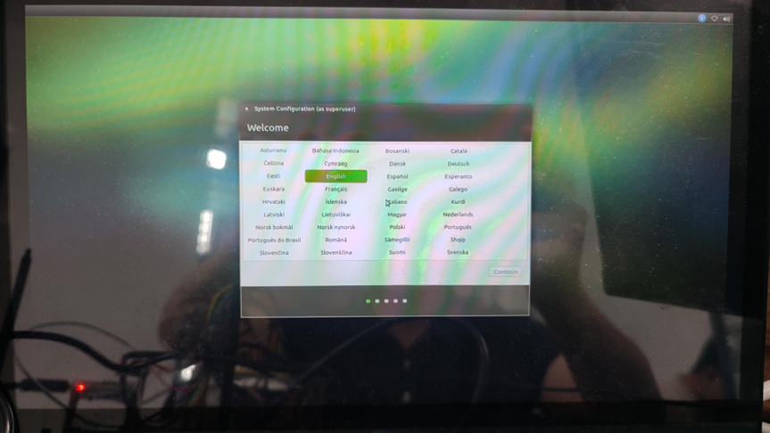

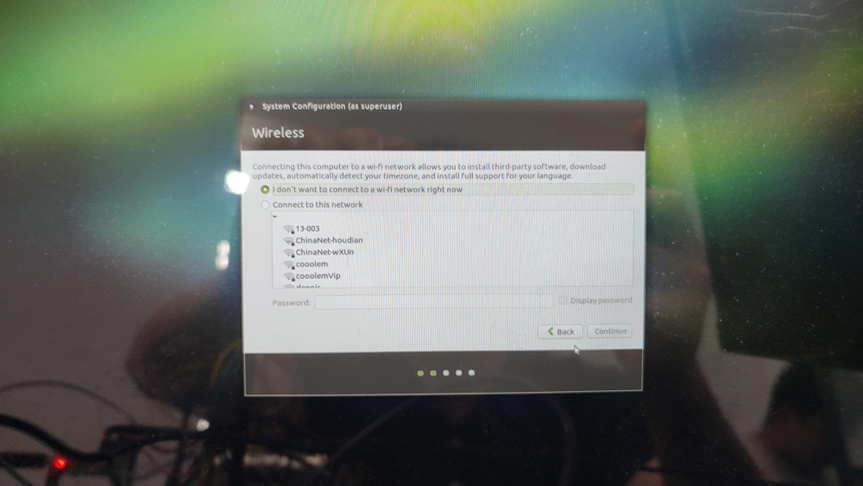

②地图选择地区shanghai——continue——Engilsh（US）——continue

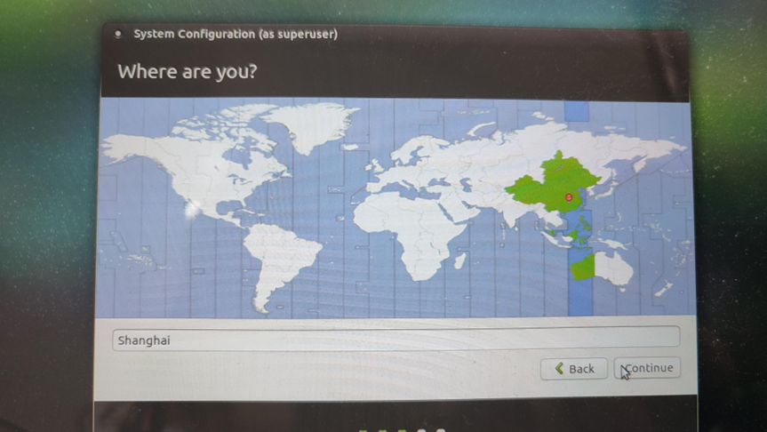

③键盘布局探测

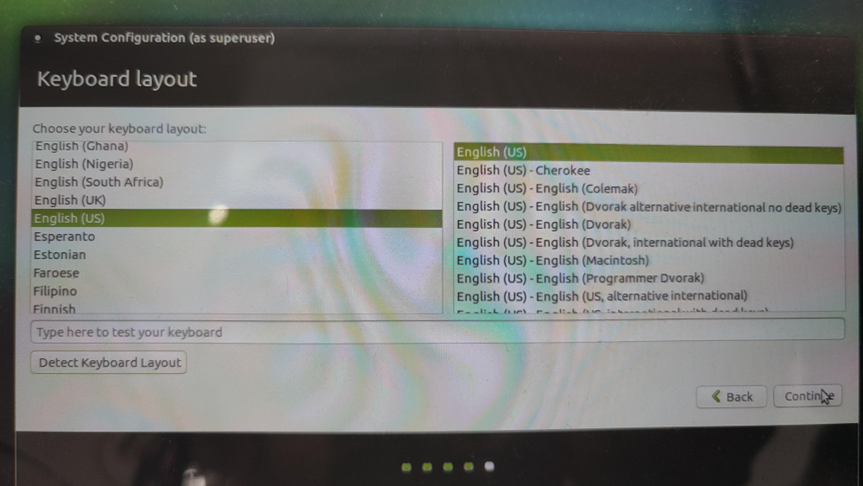

④方便起见，可将名称密码设置成如下所示：

```shell
Your name:rikirobot
Your computer's name:rikirobot
Pick a username:rikirobot
Choose a password:1
Confirm your password:1
```

勾选Log in automatically——continue

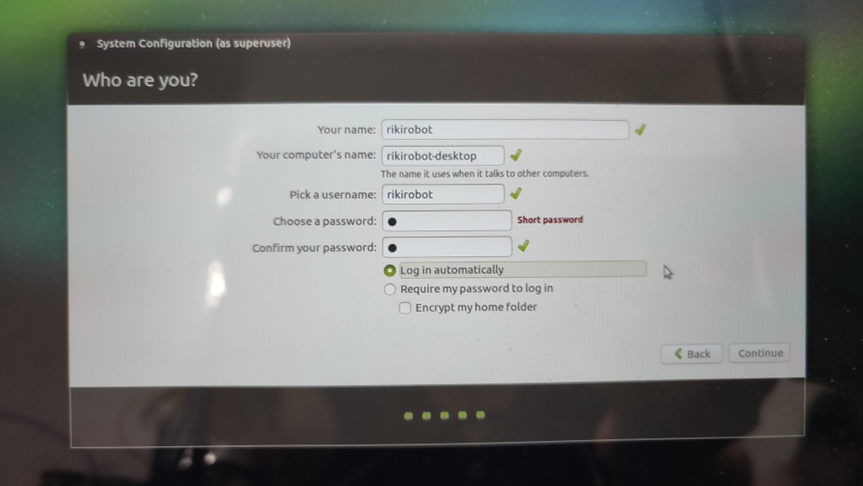

⑤等待安装。

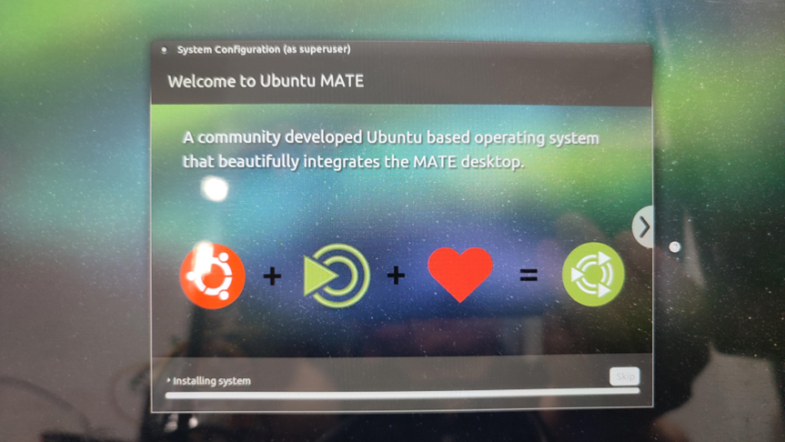

##### 2.2.2 连接网络

进入系统，树莓派端连接无线网：

①连接wifi，如看不到自己的wifi，可以重启看一下

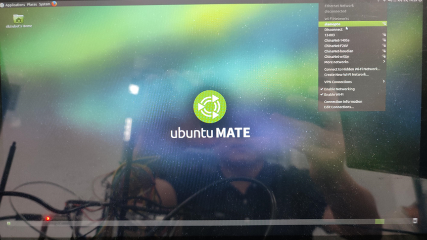

②打开终端，键盘按下 **Ctrl+Alt+t**，也可右击打开终端

输入

```
sudo apt-get install gedit
```

使用apt安装gedit。

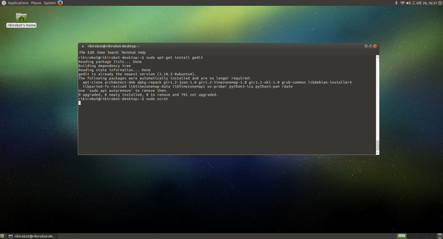

之后会要求输入密码，输入之前设置的1即可（以后也是一样）。

③出现（Y/n）的选项后输入Y然后按回车。回到可以输入命令的

rikirobot@rikirobot-desktop:~$ 行，便说明安装完成（**以后类似询问是否操作依旧输入y**）。

**注：**遇到类似报错

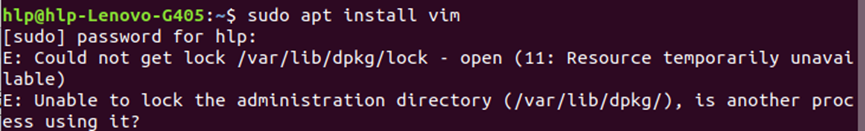

终端输入：

```
sudo rm -rf /var/lib/dpkg/lock
```

##### 2.2.3 切换系统源

使用鱼香ROS一键切换系统源，按照提示更换系统源

```
wget http://fishros.com/install -O fishros && . fishros
```

##### 2.2.4 安装ROS

使用鱼香ROS一键安装ROS，按照提示安装ros1（kinetic）

```
wget http://fishros.com/install -O fishros && . fishros
```
判断是否成功安装ROS
```
roscore
rosrun turtlesim turtlesim_node
rosrun turtlesim turtle_teleop_key
```

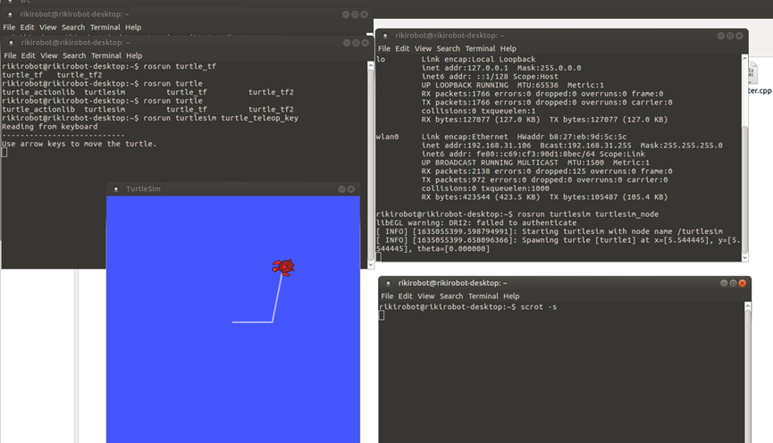


#### 2.3  git rep and catkin_make

##### 2.3.1 安装git与下载源码

```
sudo apt-get install git
```
将课程资源中的rikirobot.zip自行拷贝到树莓派主目录并右键提取到此处（或者使用git下载源码）

```
git clone https://github.com/haohaoalt/rikirobot.git
```
最终会在主目录看到rikirobot文件夹。

##### 2.3.2 更改文件权限与安装依赖

赋予installpackage.sh文件权限

```
cd /home/rikirobot/rikirobot/rules
chmod 777 -R ../catkin_ws/src/
chmod +x installpackage.sh
```

安装依赖

```
./installpackage.sh
cd ..
```

##### 2.3.3 编译准备及编译源码

为了防止树莓派编译卡死,更改部分系统参数确保编译成功

第一步：确保系统中有足够的空间来用做swap交换空间，我准备在一个独立的文件系统中添加一个swap交换文件，在/opt/image中添加2G的swap交换文件

```
sudo mkdir image
sudo touch swap
```

 第二步：添加交换文件并设置其大小为2G，使用如下命令

```
sudo dd if=/dev/zero of=/opt/image/swap bs=1024 count=2048000
```

 过段时间就返回如下结果：

 ```
2048000+0 records in
2048000+0 records out
2097152000 bytes (2.1 GB, 2.0 GiB) copied, 242.095 s, 8.7 MB/s
 ```

第三步：创建（设置）交换空间，使用命令mkswap

```
sudo mkswap /opt/image/swap
```

出现：

Setting up swapspace version 1, size = 2 GiB (2097147904 bytes)
no label, UUID=ae7cd3ce-62ef-49b0-831e-3447b5091bcd

第四步：检查现有的交换空间大小，使用命令free

```
free -m
              total        used        free      shared  buff/cache   available
Mem:            925         185          28          14         711         660
Swap:             0           0           0
```

或者检查meminfo文件

```
grep SwapTotal  /proc/meminfo
```

第五步：启动新增加的2G的交换空间，使用命令swapon

```
sudo swapon /opt/image/swap
```

出现：swapon: /opt/image/swap: insecure permissions 0644, 0600 suggested.

第六步:确认新增加的2G交换空间已经生效，使用命令free

```
free -m
             total        used        free      shared  buff/cache   available
Mem:            925         328          56          32         541         502
Swap:          1999           0        1999
```

或者检查meminfo文件

```
grep SwapTotal  /proc/meminfo
```

第七步：修改/etc/fstab文件，使得新加的2G交换空间在系统重新启动后自动生效

```cpp
sudo gedit /etc/fstab
/*
在打开文件最后一行添加 
/opt/image/swap   /swap   swap  defaults 0  0
*/
```

将树莓派端系统时间改为现在的时间，否则编译可能出错。
注意：这一步树莓派必须是联网的，否则编译会出错(联网后时间一般会自动校准)，
树莓派没有电池，断电后无法保存时间。树莓派默认安装了NTP(Network Time Protocol)服务来获取互联网上ntp服务器提供的时间。

```js
sudo apt-get install ntp  //安装ntp服务
sudo service ntp restart  //重启ntp服务
```

打开新的终端

```js
cd /home/rikirobot/catkin_ws
catkin_make -j1
```

### 3 Windows + 虚拟机安装及设置

#### 3.1 Ubuntu启动盘制作

具体可见Ubuntu16.04LST启动盘制作.pdf

#### 3.2 win+Ubuntu双系统安装

具体可见安装双系统.pdf

#### 3.3 虚拟机安装Ubuntu（推荐）
==网络连接方式选择桥接模式==

具体可见安装虚拟机与ubuntu.pdf
虚拟机需要安装ROS1
使用鱼香ROS一键切换系统源，按照提示更换系统源

```
wget http://fishros.com/install -O fishros && . fishros
```


##### 2.2.4 安装ROS

使用鱼香ROS一键安装ROS，按照提示安装ros1（kinetic）

```
wget http://fishros.com/install -O fishros && . fishros
```

判断是否成功安装ROS
```
roscore
rosrun turtlesim turtlesim_node
rosrun turtlesim turtle_teleop_key
```


### 4 烧录STM32程序

#### 4.1 STM32单片机简介

STM32的字面含义：

①ST— 意法半导体，是一个公司名，即SOC厂商

②M— Microelectronics的缩写，表示微控制器，大家注意微控制器和微处理器的区别

③32— 32bit的意思，表示这是一个32bit的微控制器。

STM32自带了各种常用通信接口，功能非常强大。主要包括：

①串口—USART，用于跟跟串口接口的设备通信，比如：USB转串口模块、ESP8266 WIFI、GPS模块，GSM 模块，串口屏、指纹识别模块。②内部集成电路—I2C，用于跟I2C接口的设备通信，比如：EEPROM、电容屏、陀螺仪MPU6050、0.96寸OLED模块。

③串行通信接口—SPI，用于跟SPI接口的设备通信，比如：串行FLASH、以太网W5500、音频模块VS1053 4、SDIO、FSMC的超级、I2S、SAI、ADC、GPIO。

STM32能做什么？

我们身边常见的智能手环，微型四轴飞行器，平衡车、扫地机、移动POST机，智能电饭锅，3D打印机都是以STM32为微控制器的电子产品。

#### 4.2 烧录单片机程序

第一步：在电脑端先准备好FlyMcu软件和需要烧录的hex文件。

第二步：使用stm32的USB232接口，与电脑端连接。（大概率需要更新驱动）

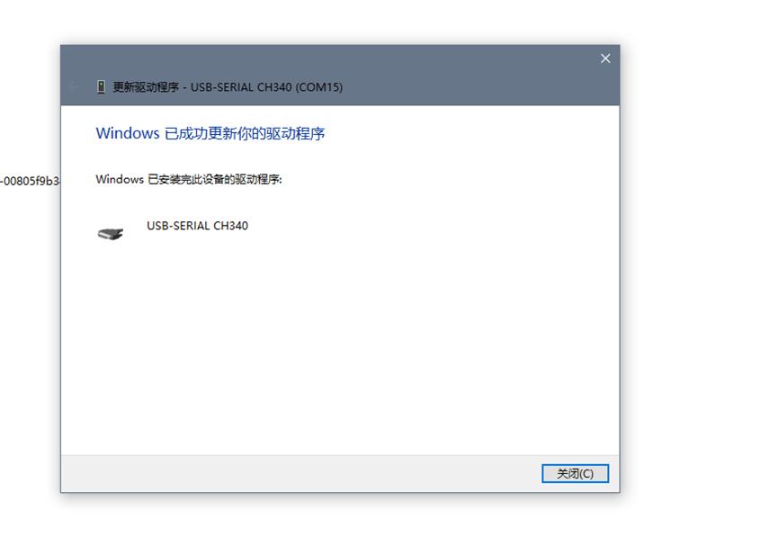

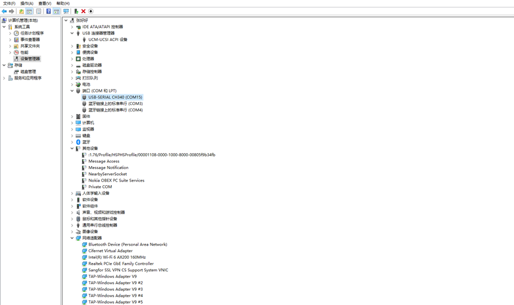

第三步：打开FlyMcu软件，选择好单片机的Port：COM15（我这边是COM15）左上角“联机下载时的程序文件”选择好hex文件的地址，左下角选择第四个“**DTR**的低电平复位， **RTS**高电平进BootLoader”。

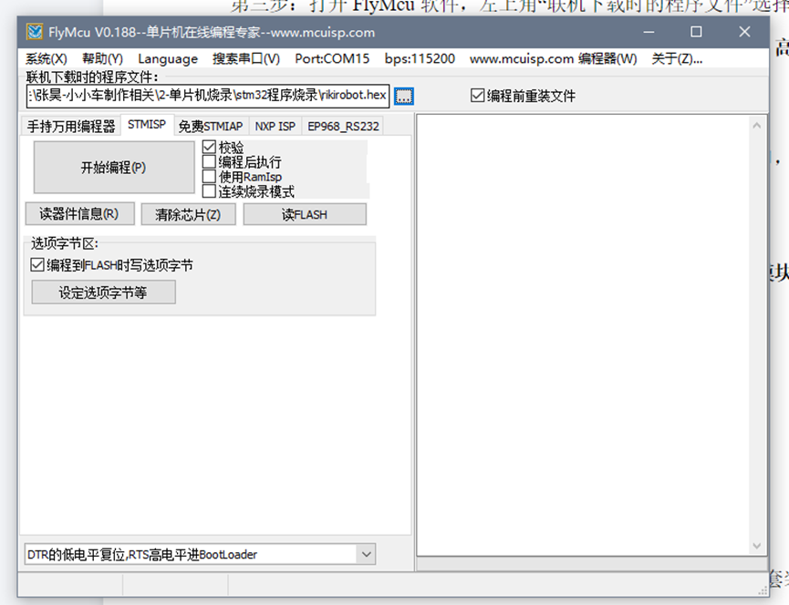

第四步：点击开始编程，待烧录完成后拔下电脑端的USB接口，将其与树莓派连接即可。

烧录程序至此结束。接着需要搭建好小车硬件模型并完成各个模块的接线。

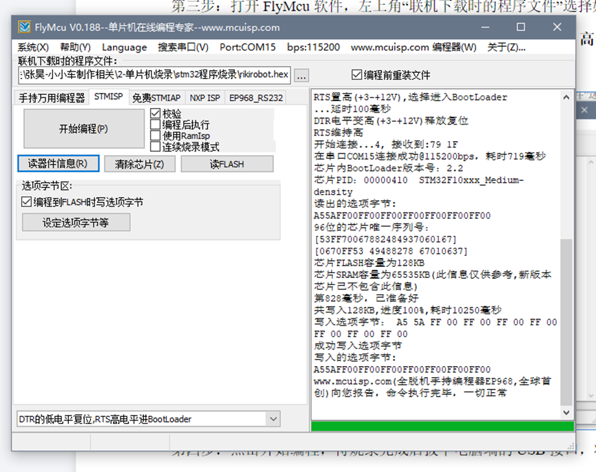

### 5 硬件搭建与接线

#### 5.1 硬件材料

硬件方面，小车主要由以下材料部件构成：

两块亚克力板（其中一块为底盘）、两个轮胎和电机编码器套装（电机的好坏不能单凭亮红灯还是绿灯判断，亮红灯的电机，有的可以正常控制运动；即使是两个绿灯的电机，它们也会出现转速不一样的问题；要找到两个转速接近的电机，用键盘控制小车走直线，如果不歪，说明两个电机是配套的。）、两个小辅助轮、稳压模块、树莓派、stm32、电机驱动与面包板、IMU一个、雷达一个、两个小开关、杜邦线若干、USB线若干、12V电池一块、六角铜柱与螺丝螺帽若干。

下面介绍部分实验器材。

底盘的大致布局如图所示，以树莓派和驱动1一侧为正方向。

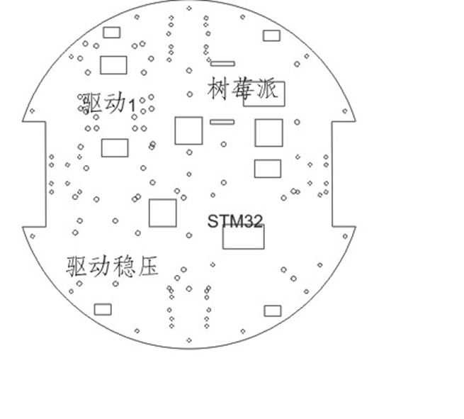

两个轮胎和电机编码器套装如图所示。

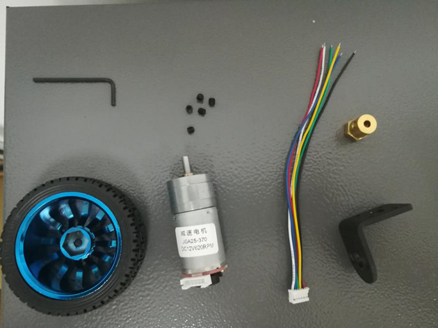

STM32（左）和IMU（右）如图所示。

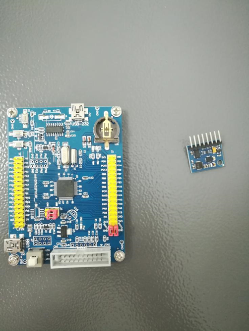

杜邦线如图所示。

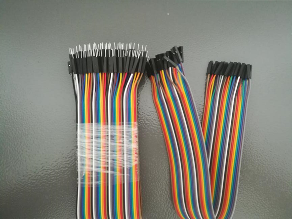

电机稳压模块如图所示。

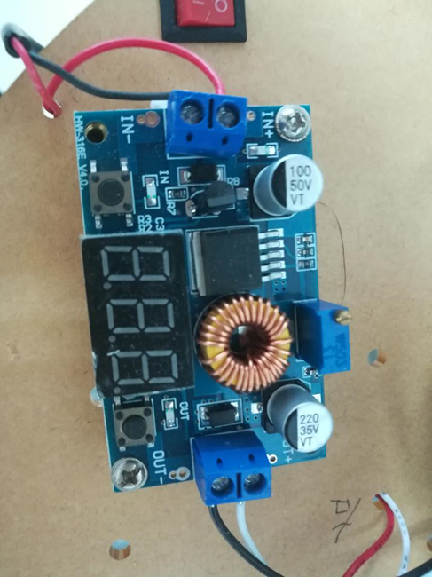

电机驱动与面包板如图所示。

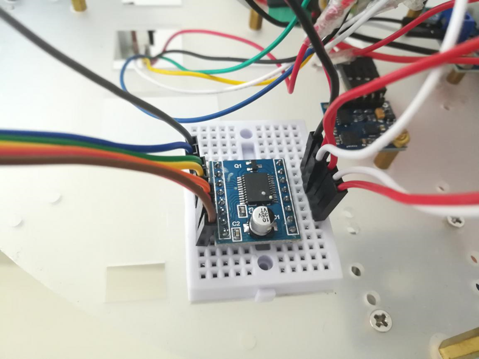

#### 5.2 硬件安装流程

①固定轮胎与电机套装。

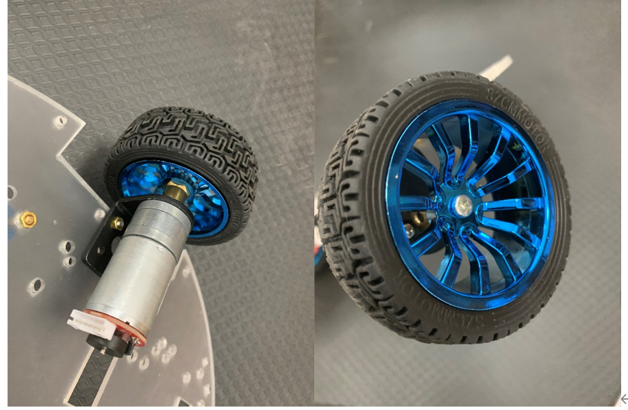

②将电机的编码器接线按照对应的颜色延长。

延长时，红白线需要最终引出杜邦线的公头，其余的蓝黑黄绿需要最终引出杜邦线的母头。

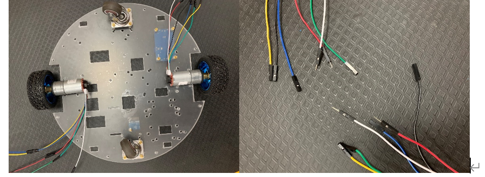

③固定辅助轮。

④稳压模块安装。

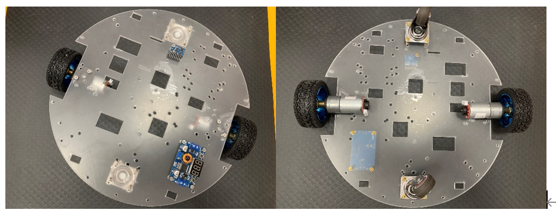

由于**树莓派需要5V**的供电，但是使用的电源是12V的，需要降压为5V。用杜邦线在该模块input端，引出正负端，并串联一个小开关，最后与电源配件（和电源配套的接线头，用于连接电源）相连接。

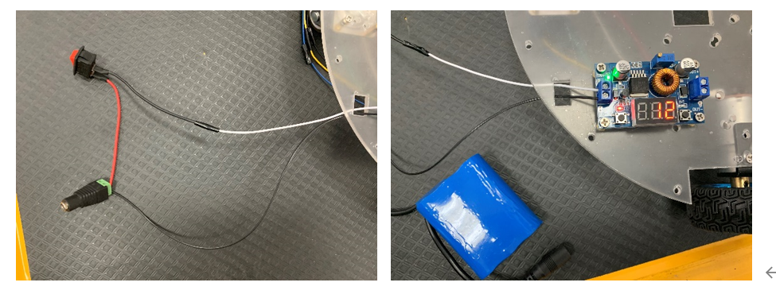

完成后，接入电源，打开开关，显示屏如果没有亮，可以按一下输入端侧的黑色按钮，就会显示输入的电压值，按一下另一侧的黑色按钮，便可以将显示改为输出端的电压值。我们需要将输出电压调节为5V，通过逆时针旋转稳压模块的电位器（蓝色的，用一字小螺丝刀旋转，刚开始需要旋转较多圈数才有反应），将输出电压调节为5V即可，然后合上开关。

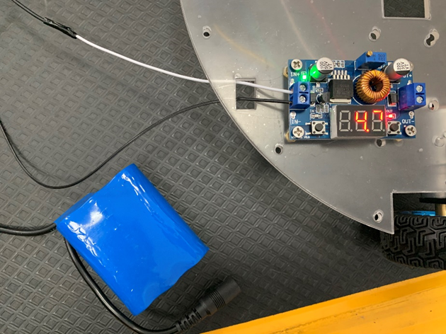

稳压模块的输出端，正负分别用公母头的杜邦线引出，公头与稳压模块连接，母头用于接入树莓派进行供电。

⑤树莓派固定好后，将有四个USB接口的接口端面向自己，此时树莓派引脚位于右手侧。

将之前稳压模块输出端引出的正极接入树莓派最右侧引脚（两排引脚的右侧那一排）的上方第一个接口，负极接入最右侧的上方第三个接口。注意千万不能接错！

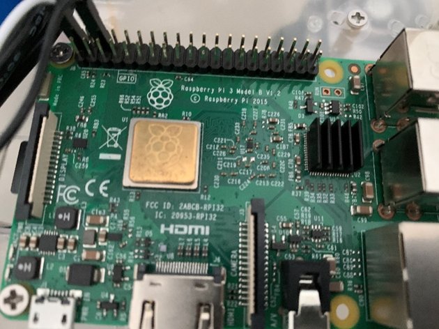

⑥先观察驱动芯片的背部引脚，画出对应的引脚图以方便后续的接线。

将驱动插入面包板，然后固定。面包板以中间的凹槽为分界，左右两边的每一排（排指的是每排五个的排）是导通的。右轮电机的红白线分别接到驱动的AO1、AO2，左轮电机的红白分别接到驱动的BO2、BO1。VM和同VM相邻的GND接口，需要使用12V的电源进行供电。找到之前稳压模块使用的电源配件接口，在原有引出的线的基础上，再分别从正负端引出杜邦线，并串联接入一个小开关，然后接入驱动的VM和GND接口（正端接入VM，负端接入GND）。使得在电源接口接入电源后，能够分两路进行供电，一路给稳压模块，一路给驱动。

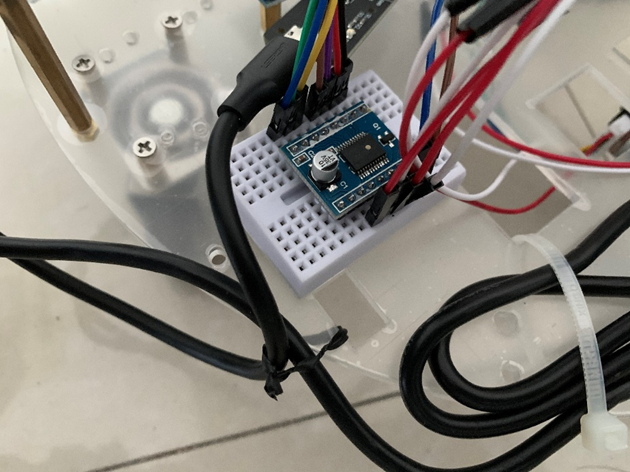

⑦用长铜柱架起，固定STM32单片机。

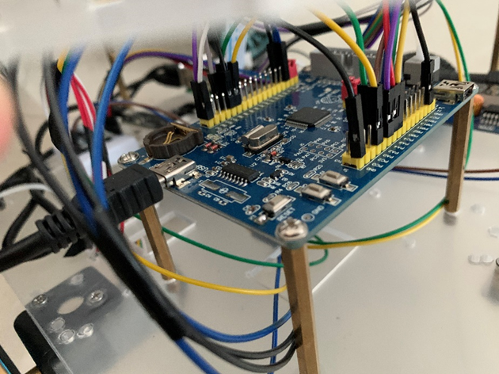

用USB接线从树莓派引出，然后接到STM32的USB232进行供电。

左右轮电机的蓝线都接STM32上的3V3接口，黑线都接GND

接口。右轮电机的黄绿线分别接PA0、PA1。左轮电机的黄绿线分别接PB6、PB7。

然后选用较长的公母头杜邦线进行面包板驱动与STM32的连接，对应如下（前者指的驱动接口，后者是STM32接口）：PWMA接PA7、AIN2接PC5、AIN1接PC4、BIN1接PA5、BIN2接PA4、PWMB接PA6、GND接GND即可。（驱动一共有三个接口是不用接的）

⑧在驱动和树莓派之间的位置，固定IMU，固定后IMU的接口应朝向后方。

接着开始IMU的接线，一共有8个接口，只需接出四个接口。把IMU螺丝孔对面的接口作为第一个接口，然后依次为2、3、4、5。使用母母头的杜邦线，2号口接STM32的3V3、3号口接GND、4号口接PB8、5号口接PB9。

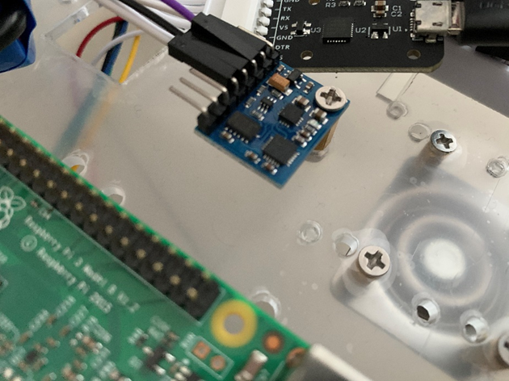

⑨使用四根长铜柱，在原有底盘的基础上架起第二层，用于安装固定雷达（雷达需提前固定、雷达突出的方向为正方向）。固定后，用USB接口将雷达与树莓派连接即可。（雷达可先不接，待前面全部调试成功后再接入）

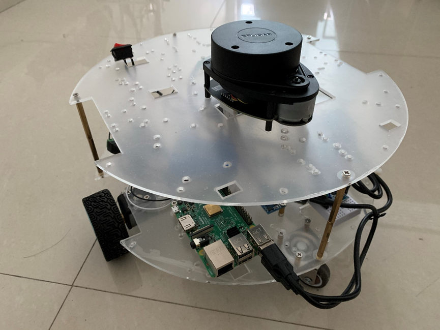

### 6 智能车调试

#### 6.1 新手指南

激光雷达，是以发射激光束探测目标的位置、速度等特征量的雷达系统。其工作原理是向目标发射探测信号(激光束),然后将接收到的从目标反射回来的信号(目标回波)与发射信号进行比较,作适当处理后,就可获得目标的有关信息,如目标距离、方位、高度、速度、姿态、甚至形状等参数,从而对飞机、导弹等目标进行探测、跟踪和识别。

惯性测量单元（Inertial Measurement Unit）由三个单轴的加速度计和三个单轴的陀螺仪组成。

加速度计检测物体在载体坐标系统独立三轴的加速度信号，陀螺仪检测载体相对于导航坐标系的角速度信号。对这些信号进行处理之后，便可解算出物体的姿态。

#### 6.2 准备工作

先启动小车并尝试用键盘控制。

！！！注意：使用虚拟机的同学请务必将电脑虚拟机的联网模式改为桥接模式，具体方法请自行上网查找。在改成桥接模式后再进行后续操作。

为了将小车与笔记本连接并进行控制，首先需要在笔记本端进行配置。在终端输入：

```
sudo gedit /etc/hosts
```

在打开的文件中，第三行输入**树莓派**在局域网下的**IP**：

```
192.168.50.205  rikirobot-desktop
```

保存并关闭

然后ssh小车（注意，未防止权限不够，此处ssh加一个-X）

```
ssh -X rikirobot@192.168.XX.XX
```

同样的

```
sudo gedit /etc/hosts
```

在打开的文件中，第三行输入**笔记本电脑**在局域网下的**IP**：

```
192.168.50.7 hao
```

上述笔记本的名称可通过笔记本打开终端时查看，是@后面的内容

如my-pc@my-pc: ~$则，名称为my-pc。

然后保存并关闭

继续在连接到树莓派的终端输入hostname，看到输出的名字为：xxx
编辑.bashrc文件
```
sudo gedit .bashrc
```
在打开的文档末尾加上：

```
export ROS_MASTER_URI=http://xxx:11311
```


然后保存并关闭文档。

为了使环境变量生效，继续在终端输入：

```
source .bashrc
```

注意，6.2 准备工作至此的配置操作只需进行一次，不用每次连接小车都做。（除非更换局域网，需要重新修改IP地址）

在确保笔记本和小车树莓派连接在同一局域网下后，可以开始连接小车。

额外测试指令：

笔记本客户端**roscore**

树莓派端：

```
rosrun turtlesim turtlesim_node
rosrun turtlesim turtle_teleop_key
```


电脑端终端输入：

```
roscore
```

不要关闭它，然后重新开一个终端。

```
ssh rikirobot@192.168.xxx.xxx
roslaunch rikirobot bringup.launch
```

（注意，每次树莓派bringup前，都需要自己电脑先roscore。）

再新开终端 

```
ssh rikirobot@192.168.xxx.xxx
rosrun teleop_twist_keyboard teleop_twist_keyboard.py（开启键盘控制机器人）
```

控制正常的话，可以关闭所有终端开始调试校正。

#### 6.3 校正步骤

##### 6.3.1 IMU校正

电脑端终端下先roscore，再新开终端ssh连接小车，然后bringup启动小车：

```
ssh rikirobot@192.168.xxx.xxx
roslaunch rikirobot bringup.launch
```

电脑端打开新终端，ssh连接小车后进入imu的校准文件目录：

```
roscd rikirobot
cd param/imu
rosrun imu_calib do_calib
```

（此处小车需先正常放置于平地上再进行回车操作）看提示按六次回车即可，完成后关闭所有终端，重新ssh连接小车并bringup：

```
ssh rikirobot@192.168.xxx.xxx
roslaunch rikirobot bringup.launch
```

！！！注意：此时可能会有同学在bringup后出现imu信息的警告问题。依照经验来看，很大概率是因为imu的引脚没焊接好或者松动虚焊，请用万用表测试引脚是否焊接完好。（没有警告请忽视这条）

新开一个终端，ssh连接小车：

```
ssh rikirobot@192.168.xxx.xxx
rostopic echo /imu/data
```

进行查看，可按ctrl+C暂停，观察是否满足图中所述。满足的话关闭所有终端。

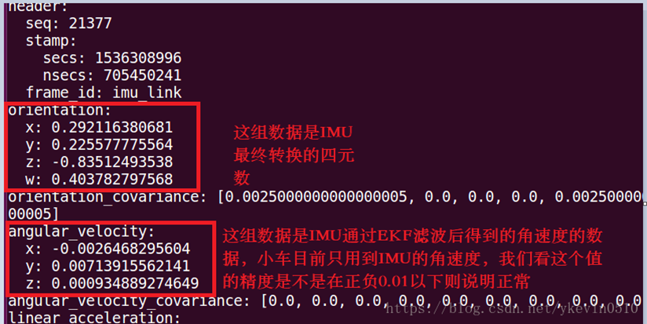

##### 6.3.2 线速度校正

通过第三章第十二步的方式连接树莓派，需要先ssh树莓派。连接后点击连接便可查看小车树莓派的文件夹内容。

进入小车的文件夹：**/catkin_ws/src/rikirobot_project/rikirobot/launch**

找到**bringup.launch**并右键使用gedit打开。

将<param name="angular_scale" value="1.0" />

　 <param name="linear_scale" type="double" value="1.0" />

这两行角速度和线速度的参数都改为1.0后保存并关闭。

然后电脑端打开终端，记得先roscore，

笔记本端**roscore**

然后ssh连接小车并bringup启动：

```
ssh rikirobot@192.168.xxx.xxx
roslaunch rikirobot bringup.launch
```

电脑端打开新终端，ssh连接小车后：

```
rosrun rikirobot_nav calibrate_linear.py
```

执行线速度校准脚本，出现INFO后，再电脑端打开一个终端输入：

```
rosrun rqt_reconfigure rqt_reconfigure
```

！！！注意：此时可能会有同学在打开rqt后发现左侧栏空白。依照经验来看着很有可能是因为hosts和bashrc没有准确设置。具体步骤请参照6.2准备工作。简单来说，①笔记本需要在hosts文件中添加树莓派的IP与树莓派的名称②树莓派需要在hosts文件中添加笔记本的IP与笔记本的名称③树莓派的bashrc文件中添加export …的相关信息。

打开rqt工具后,左侧选第一项，准备好卷尺，预留两米的长度，将小车摆在卷尺起始处，然后勾选**start_test**，小车就会开始向前。

待小车停止后，确定小车的距离，如果行进了1.5米，就将start_test上一行的系数改为1.5，然后再次摆正小车，再次勾选start_test，若小车行驶距离差不多为1米，则记下最终修改的系数。回到之前的bringup.launch文件，将linear_scale那一行的value数值的1.0改为调试后的数值，如之前举例中的1.5。关闭所有终端。

##### 6.3.3 角速度校准

同理，电脑端打开ssh连接小车并bringup启动：

```shell
ssh rikirobot@192.168.xxx.xxx
roslaunch rikirobot bringup.launch
```

电脑端打开新终端，ssh小车后：

```shell
rosrun rikirobot_nav calibrate_angular.py
```

执行角速度校准脚本，出现INFO后，再打开新终端：

```shell
rosrun rqt_reconfigure rqt_reconfigure
```

打开rqt工具后，左侧选第一项，将小车放在地上，记下初始的朝向，然后勾选start_test小车就会开始旋转

待小车停止后，用手机指南针测量小车旋转的角度，比如转过396度，396/360＝1.1，则将参数改为1.1，再次start_test查看小车是否旋转角度差不多为360度。最终确定系数后返回bringup.launch,将angular的value＝1.0修改为最终确定的数值，保存即可。

至此，调试校正完成。关闭所有终端。

##### 6.3.4 slam建图

电脑端打开终端ssh连接小车并bringup启动，记得roscore。

```
ssh rikirobot@192.168.xxx.xxx
roslaunch rikirobot bringup.launch
```

电脑端新开一个终端输入：

```
ssh rikirobot@192.168.xxx.xxx
roslaunch rikirobot auto_slam.launch
```

可能会失败，可以多试几次，直到出现odom received!（需仔细观察）

在出现odom received!后，电脑端新开终端，输入：

**rviz** 打开rviz可视化界面，如图所示。

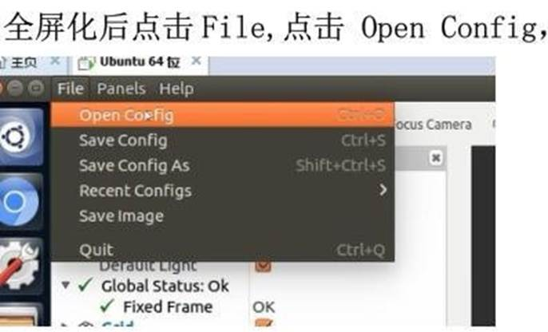

在 RVIZ 的 file 中加载 ：（需将下列地址的**auto_slam.rviz****文件**复制出来到电脑端）

**rikirobot_project/rikirobot/auto_slam.rviz** 文件

界面中左侧有许多打钩的选项，可以自行尝试关闭或打开，感受效果。

然后可以新开终端，ssh小车后打开键盘控制。

电脑端终端输入：

```
ssh rikirobot@192.168.xxx.xxx
roslaunch rikirobot bringup.launch
rosrun teleop_twist_keyboard teleop_twist_keyboard.py
```

并在选中键盘控制终端下控制小车，实现区域建图。

rviz界面的顶部有两个绿色的箭头，可以尝试选择右边的导航按键，然后在地图上标记目标点，小车会自动前往目标点并避开图中的障碍（简单的环境中应该是能够实现的）

在完成建图后，可以电脑端新开终端，ssh小车并切换到maps文件夹。终端输入：

```
ssh rikirobot@192.168.xxx.xxx
roscd rikirobot/maps
./map.sh
```

便可保存地图。

### 7 附录

#### 附录1：可供参考自学的资料

- 树莓派：Raspberry Pi 3 Model B 菜鸟入门

https://blog.csdn.net/dddidi_/article/details/79181911

- Ubuntu系统的基本使用

https://blog.csdn.net/AndesStay/article/details/82143515

- Ubuntu快速上手指南（想给Ubuntu系统安装一些常用软件）

https://www.bilibili.com/video/BV1TE411A7TT/?spm_id_from=333.337.search-card.all.click&vd_source=968f7130c55722e3f43294e4083f9781

https://blog.csdn.net/u014630636/article/details/51996498

- windows下安装虚拟机+ Ubuntu的详细过程

https://blog.csdn.net/u012611644/article/details/80728806

利用移动端ssh小车及电脑端，通过移动端控制小车运动：

手机端：JuiceSSH软件 具体操作可以参考官网流程，ip地址进行ssh

ipad端：Termius 操作界面比较简单

- TB6612FNG 电机驱动 

TB6612是双驱动，可以驱动两个电机

STBY口接单片机的IO口，清零电机全部停止，置1通过AIN1,AIN2,BIN1,BIN2来控制正反转；VM接12V以内电源 VCC接5V电源

驱动1路

PWMA 接单片机的PWM口

真值表

AIN1 0 0 1

AIN2 0 1 0

停止 正传 反转

AO1 AO2接电机1的两个脚

驱动2路

PWMB 接单片机的PWM口

真值表

BIN1 0 0 1

BIN2 0 1 0

停止 正传 反转

BO1 BO2接电机2的两个脚


#### 附录2：材料清单

| **示意图**                                                   | **介绍**                                                     |                         **购买链接**                         |
| ------------------------------------------------------------ | ------------------------------------------------------------ | :----------------------------------------------------------: |
|  | 带霍尔编码器电机，最大载重9KG，25GA370电机编码器。  12v 620rad/min ,330rad/min  根据载重及需要的速度选择。 | https://item.taobao.com/item.htm?spm=a230r.1.14.20.4a8966187RqiPv&id=533000737918&ns=1&abbucket=3#detail |
| 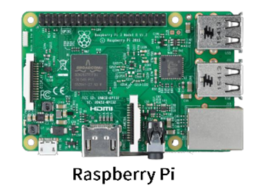 | 树莓派做上位机主控，安装Linux系统  树莓派3b 裸板。           | https://item.taobao.com/item.htm?spm=a230r.1.14.55.688a264ai8w1DP&id=527576110046&ns=1&abbucket=3#detail |
| 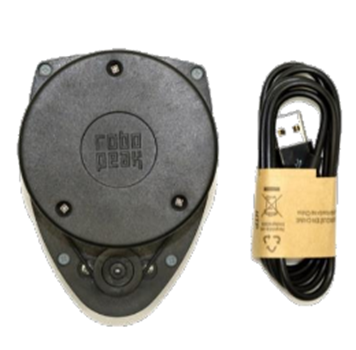 | 思岚RPLIDAR  A1/A2/A3。                                      | https://item.taobao.com/item.htm?spm=a230r.1.14.106.1e53783du1gLjW&id=579103092794&ns=1&abbucket=4#detail |
|  | 亚克力板，需要提供CAD图纸。                                  | https://item.taobao.com/item.htm?spm=a1z09.2.0.0.67002e8dnNCjMm&id=566342606667&_u=c1i889gs6868 |
|  | TF卡，用于扩展树莓派存储空间。                               | https://detail.tmall.com/item.htm?id=23788884293&spm=a1z09.2.0.0.67002e8dnNCjMm&_u=c1i889gs65GY-85d0 |
| 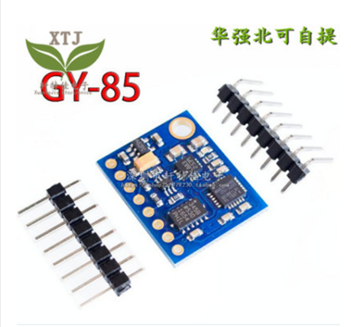 | GY-85 九轴 IMU传感器。                                       | https://item.taobao.com/item.htm?spm=a1z09.2.0.0.67002e8dnNCjMm&id=561228177874&_u=c1i889gs4714 |
| 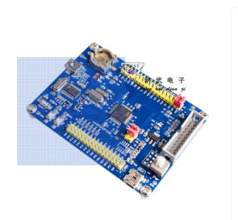 | STM32F103单片机用来做底层控制器，需要一键下载功能。          | https://item.taobao.com/item.htm?spm=a1z09.2.0.0.67002e8dnNCjMm&id=561032538586&_u=c1i889gs34a3 |
|  | 12V 供电。                                                   | https://detail.tmall.com/item.htm?id=520111996213&spm=a1z09.2.0.0.67002e8dnNCjMm&_u=c1i889gs696a |
| 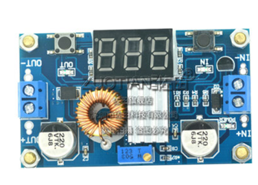 | 稳压模块，将12V电压降压成5V给树莓派供电。                    | https://detail.tmall.com/item.htm?id=574354676817&spm=a1z09.2.0.0.67002e8dnNCjMm&_u=c1i889gs15f7 |
|  | 万向轮，用于辅助平衡。1.25寸。                               | https://item.taobao.com/item.htm?spm=a1z09.2.0.0.67002e8dnNCjMm&id=583384136909&_u=c1i889gsaed4 |
| 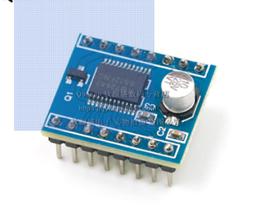 | 电机驱动，控制正反转等。                                     | https://detail.tmall.com/item.htm?id=557687336997&spm=a1z09.2.0.0.67002e8dnNCjMm&_u=c1i889gs70cc |
|  | 用于配合驱动使用。                                           | https://detail.tmall.com/item.htm?id=581367851046&spm=a1z09.2.0.0.67002e8dnNCjMm&_u=c1i889gs51f8 |
|  | 树莓派散热                                                   | https://detail.tmall.com/item.htm?id=576024492597&spm=a1z09.2.0.0.67002e8dnNCjMm&_u=c1i889gsa97f |
| 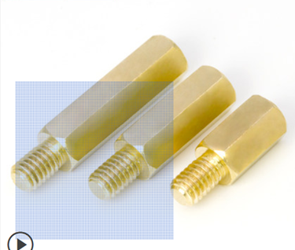 | 用于架起部分模块和第二层底盘。  M3* 4+ 6  M3*10+6  M3*45+ 6  | https://detail.tmall.com/item.htm?id=19634185206&spm=a1z09.2.0.0.67002e8dnNCjMm&_u=c1i889gs21e6 |
|  | 同上。  M3                                                   | https://detail.tmall.com/item.htm?id=42291180887&spm=a1z09.2.0.0.67002e8dnNCjMm&_u=c1i889gscf70 |
|  | 螺丝  M3*8  M3*10                                            | https://detail.tmall.com/item.htm?id=529652825301&spm=a1z09.2.0.0.67002e8dnNCjMm&_u=c1i889gs2dd4 |
|  | 开关。                                                       | https://detail.tmall.com/item.htm?spm=a220m.1000858.1000725.27.364e788fb4yUOj&id=576889063211&skuId=3801554073254&areaId=320500&user_id=2207691322&cat_id=2&is_b=1&rn=8d752cea0f5ca80d33cc864d95773c2e |
| 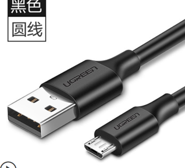 | 用于连接树莓派与STM32。                                      | https://detail.tmall.com/item.htm?spm=a220m.1000858.1000725.2.46ec5a79LGWl6q&id=16184646887&skuId=3960031335855&areaId=320500&user_id=713464357&cat_id=2&is_b=1&rn=ea063e7c64eb923de2c56706ec9afe28 |
| 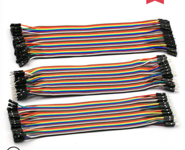 | 杜邦线15cm，30cm  公公、公母、母母三种型号                   | https://detail.tmall.com/item.htm?id=41254478179&ali_refid=a3_430583_1006:1109983619:N:MsF9mE9KLTC2IibWJh+K1A==:9da2017571e226e04a39097b54542188&ali_trackid=1_9da2017571e226e04a39097b54542188&spm=a230r.1.14.3&skuId=3214771215838 |
|  | 读卡器，用于安装树莓派ubuntu mate系统。                      |         https://item.jd.com/1225383.html#crumb-wrap          |
|  | 绝缘胶，用于延长杜邦线时包住对接处，起绝缘作用。             |            https://item.jd.com/100005803378.html             |
|  | 剥线钳。                                                     |               https://item.jd.com/5821575.html               |
|  | 一体式键鼠                                                   | https://item.m.jd.com/product/12555096091.html?utm_user=plusmember&gx=RnFlw2cKOzPbndRP--txXX43zTbc89GNnY-g&ad_od=share&utm_source=androidapp&utm_medium=appshare&utm_campaign=t_335139774&utm_term=Wxfriends |
|  | 便携式显示模块                                               | 【淘宝】https://m.tb.cn/h.UgVfxmf?tk=8vc1d1X8xuS CZ0001 「CFORCE便携显示器15.6英寸4K副屏OLED扩展144Hz外接Switch显示屏」 |

#### 附录3：常见问题自查

问题1：

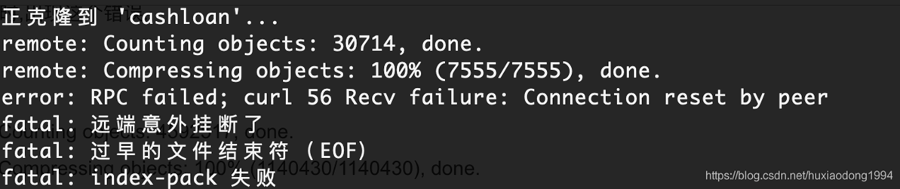

参考方法：

因为是第一次拉取线上项目，项目过大，导致每次拉取都报错，所以需要设置一个git的最大缓存大小。

git config --global http.postBuffer 524288000

在终端使用上述命令，问题即可解决。

问题2：

Python出现Could not find a version that satisfies the requirement openpyxl (from versions: )

参考方法：

一个原因是pip版本过低，需要更新pip：
 python -m pip install --upgrade pip

也可能考虑到是python国内网络的问题，这时我们用国内的镜像源来加速。
 pip install 包名 -i http://pypi.douban.com/simple/ --trusted-host pypi.douban.com

问题3：

用vim打开一个文件时，其会产生一个cmd.swap文件，用于保存数据，当文件非正常关闭时，可用此文件来恢复，当正常关闭时，此文件会被删除，非正常关闭时，不会被删除，所以提示存在.swap文件。

参考方法：

使用命令sudo rm -f .bashrc.swp恢复文件即可。

问题4：

Win10安装ubuntu16.04(18.04)双系统

参考方法：
 https://www.cnblogs.com/masbay/p/10844857.html

问题5：

Ubuntu下怎么退出vim编辑器

参考方法：

可以尝试给要编辑的文件sudo权限（例如：sudo vim /file_path）。

进入编辑器之后按下字母 “i” 进入编辑模式。编辑完毕，要退出，先按“Esc”。

1、保存并退出——shift+zz 或者 :wq!

2、不保存退出——:q!

3、强制退出——:!

4、正常退出——:q

问题6：

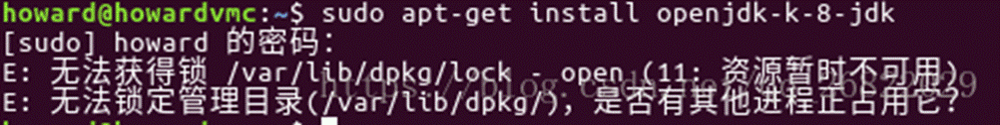

参考方法：

sudo rm /var/cache/apt/archives/lock
 sudo rm /var/lib/dpkg/lock

问题7：rqt工具报错

运行 rqt_reconfigure 错误

参考方法：

屏蔽.bashrc中的Anaconda路径

\# export PATH=/home/zach/anaconda3/bin:$PATH；

安装相关文件：conda install setuptools 和 pip install -U rosdep rosinstall_generator wstool rosinstall six vcstools；

重启窗口，运行 rosrun rqt_reconfigure rqt_reconfigure；

Ubuntu install of ROS Kinetic

http://wiki.ros.org/kinetic/Installation/Ubuntu


